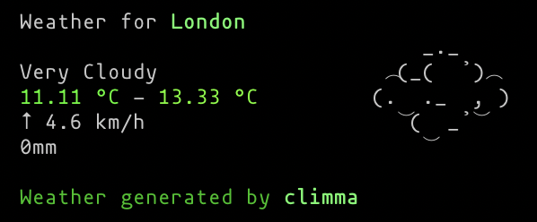

**climma** is the weather channel for your terminal.



## Features

- Uses Openweathermap API
- Rendered with [Ink](https://github.com/vadimdemedes/ink)
- Awesome ASCII art for weather conditions
- Autoformatting with Prettier
- Typescript support

## Installation

`npm install -g climma`

## Usage

`$ climma <city>`

When running `climma` for the first time it'll create `.climmarc` on the user's $HOME directory and exit the program.
Afterwards, edit it with the credentials for your API:

1. Create an account on Openweathermap and get your API key
2. Update `$HOME/.climmarc`:

```bash
API_KEY=YOUR_KEY_HERE
```

> Tip: If you want a city with a composed name, e.g. Rio de Janeiro, use double quotes around the city name:
> 
```bash
$ climma "Rio de Janeiro"
```

## Roadmap

- Support for multiple providers
- Tuning configuration for metric system and other informations. Currently **climma** uses the metric system.
- Next days forecast
- Complete ASCII art library
- Testing with Jest

## Contributing

Feel free to fork and open a Pull Request.
